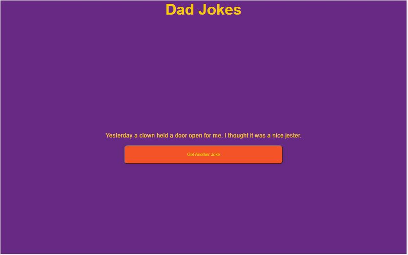

# [Dad Jokes](https://github.com/bradtraversy/50projects50days/tree/master/dad-jokes)

### Day 10 - Dad Jokes

This is a simple project that has generates a random dad joke from an API. It also has a button that allows you to generate a new joke. I used the [icanhazdadjoke API](https://icanhazdadjoke.com/api) to get the jokes.

 

# Output:

