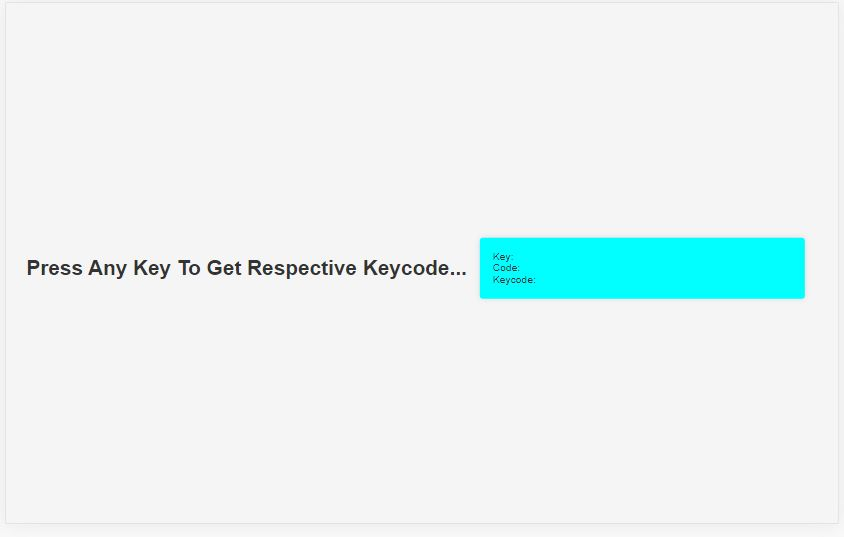
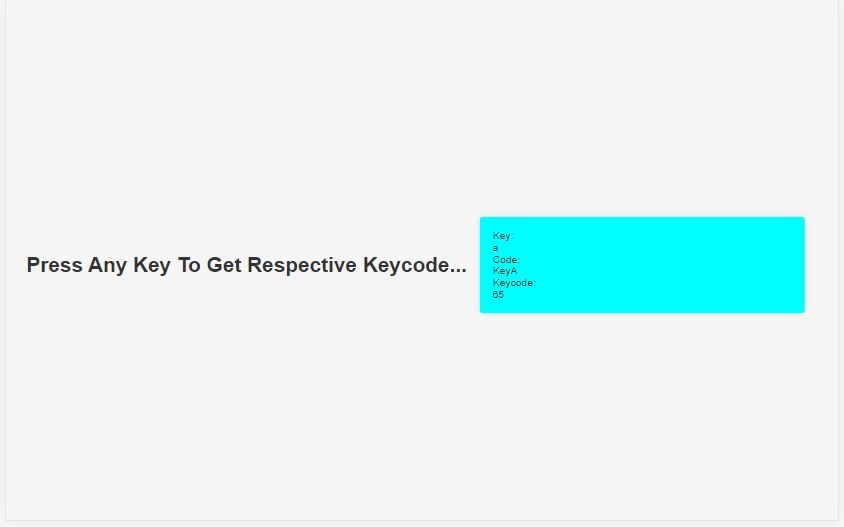

# [Event Keycodes](https://github.com/bradtraversy/50projects50days/tree/master/event-keycodes)

### Day 11 - Event Keycodes

This is a simple project that will show you the keycodes of the keys you press on your keyboard. It will also show you the keycodes of the keys you press on your numpad. It will also show you the keycodes of the keys you press on your mouse.

 

# Output:

 

