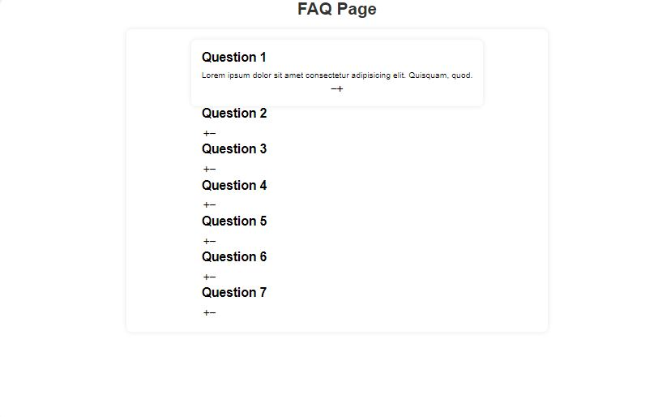
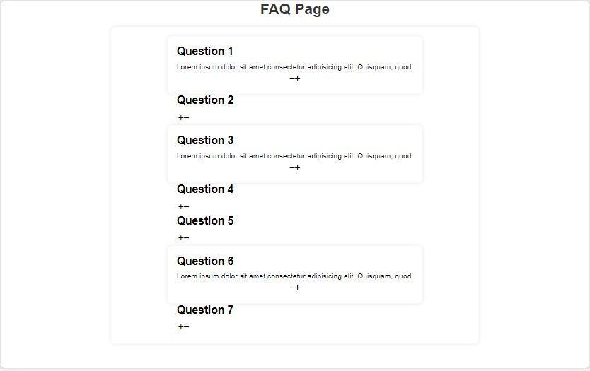

# [FAQ Collapse](https://github.com/bradtraversy/50projects50days/tree/master/faq-collapse)

### Day 12 - FAQ Collapse

This is a simple project that is a FAQ Page. It has a list of questions and answers. When you click on the question, the answer will open up. When you click on another question, the answer will close and the new answer will open.

 

# Output:

 

