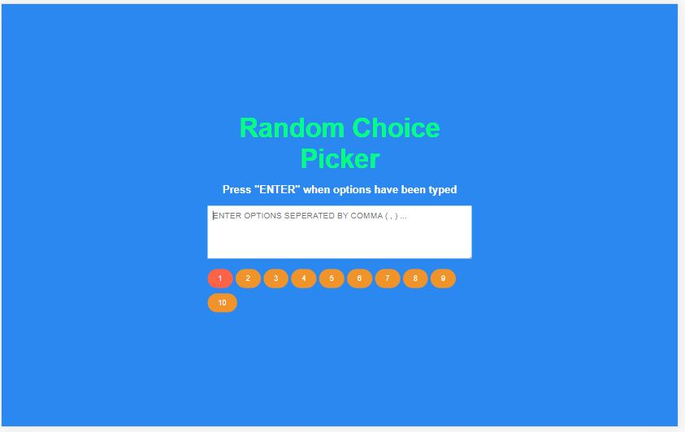

# [Random Choice Picker](https://github.com/bradtraversy/50projects50days/tree/master/random-choice-picker)

### Day 13 - Random Choice Picker

This is a simple project that will take a user input of various choices seperated by commas ( , ) . The code will then select a choice at random using the JavaScript logic. 

 

#### Notes:
- Was not able to figure out the logic for the animation of selection, hence I had to refer the actual code.
- The code uses the `Math.random()` function to generate a random number between 0 and 1. This number is then multiplied by the number of choices and rounded down to the nearest integer. This integer is then used to select the choice from the array of choices.

 

*Will try to attempt this again after trying to mimick the logic in another future project*

 

# Output:

 

