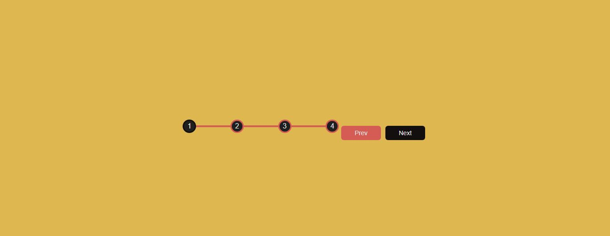

# [Progress Steps](https://github.com/bradtraversy/50projects50days/tree/master/progress-steps)

### Day 2 - Progress Steps

This is a simple project that uses CSS transitions for buttons to change color and text when clicked. The buttons are also responsive and will adjust to the size of the screen. 

 

# Output:

