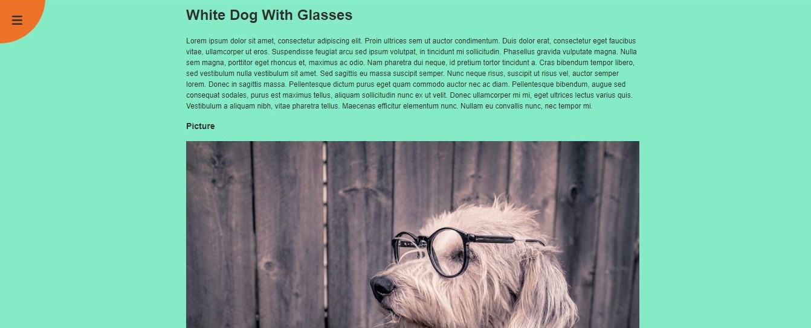
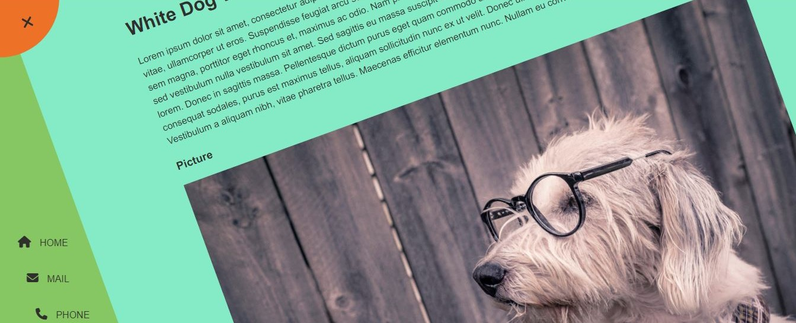

# [Rotating Navigation Animation](https://github.com/bradtraversy/50projects50days/tree/master/rotating-nav-animation)

### Day 3 - Rotating Navigation Animation

This is a simple project that uses CSS transitions to create a rotating navigation animation. The navigation bar is hidden and when the user clicks the menu button, the navigation bar rotates into view. When the user clicks the close button, the navigation bar rotates out of view.

 

## Notes:
Faced some issues while making the navigation bar rotate. Had to take some help from the original build code.

 

# Output:

