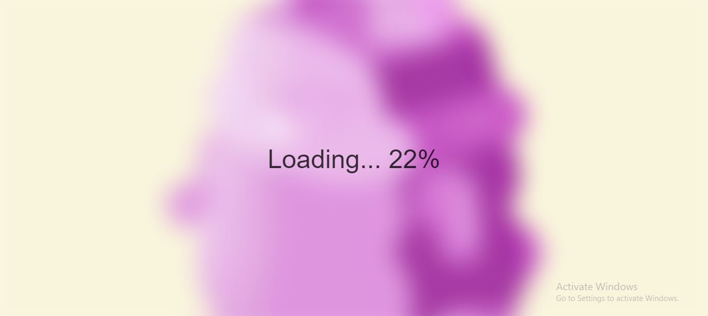

# [Blurry Loading](https://github.com/bradtraversy/50projects50days/tree/master/blurry-loading)

### Day 5 - Blurry Loading

This is a simple project that will slowly make an image from blur to clear using CSS transitions. The image will be blurred at first and then slowly become clear as the transition is completed.

 

## Notes:
- While making this project, I was facing issues while making the image blur and to use the counting effect to make the image clear. I was able to solve the issue by using this
[link](https://stackoverflow.com/questions/10756313/javascript-jquery-map-a-range-of-numbers-to-another-range-of-numbers).

- I was also facing issues initially when typing the code for the transition. I was actually using the wrong syntax for the transition. I was making the image fade out and the text come into the frame. I was able to correct this using the JS code.

 

# Output:

