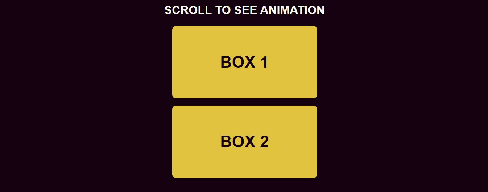
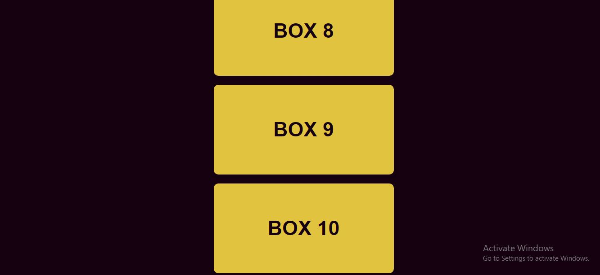

# [Scroll Animation](https://github.com/bradtraversy/50projects50days/tree/master/scroll-animation)

### Day 6 - Scroll Animation

This is a simple project that will slowly reveal boxes as we scroll down the page. This is a very simple project that will help us understand how to use the scroll event listener and how to use the window.scrollY property.

 

# Output:

