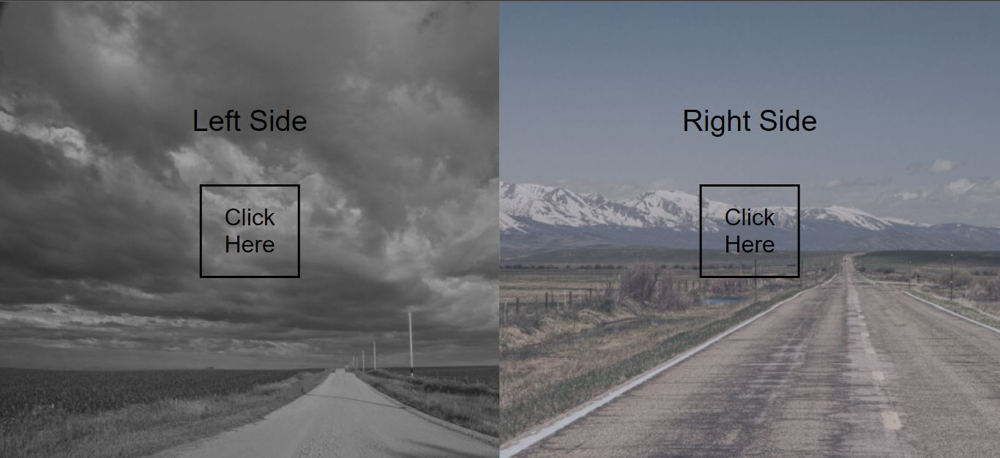
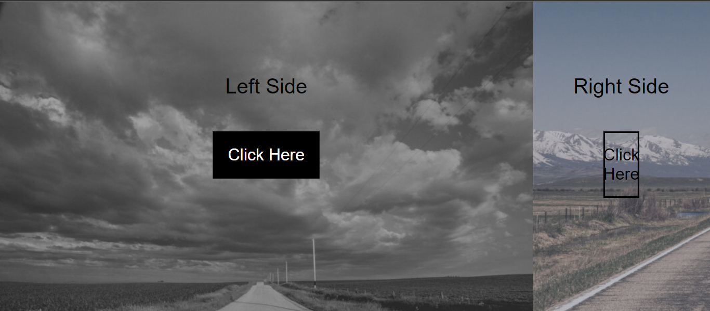
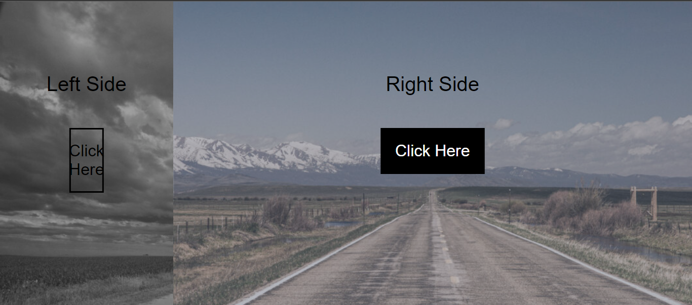

# [Split Landing Page](https://github.com/bradtraversy/50projects50days/tree/master/split-landing-page)

### Day 7 - Split Landing Page

This is a simple project that has a split landing page with a toggle button to switch between the two sides. The design is very simple and the focus is on the JavaScript. As we put the cursor on the image, the respective landing page will be shown.

 

# Output:

