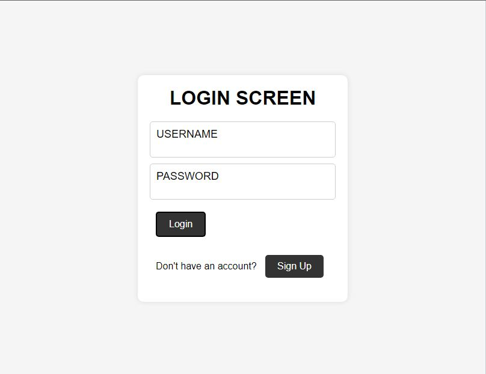
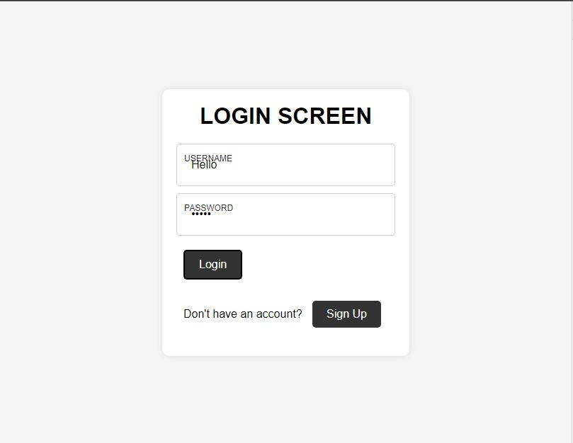

# [Form Input Wave](https://github.com/bradtraversy/50projects50days/tree/master/form-input-wave)

### Day 8 - Form Input Wave

This is a simple project that has a landing page with a login form. The design is very simple and the focus is on the JavaScript. As we put the cursor on the input field, the respective input field will be highlighted and it will move up and down like a wave.

 

# Output:

 

